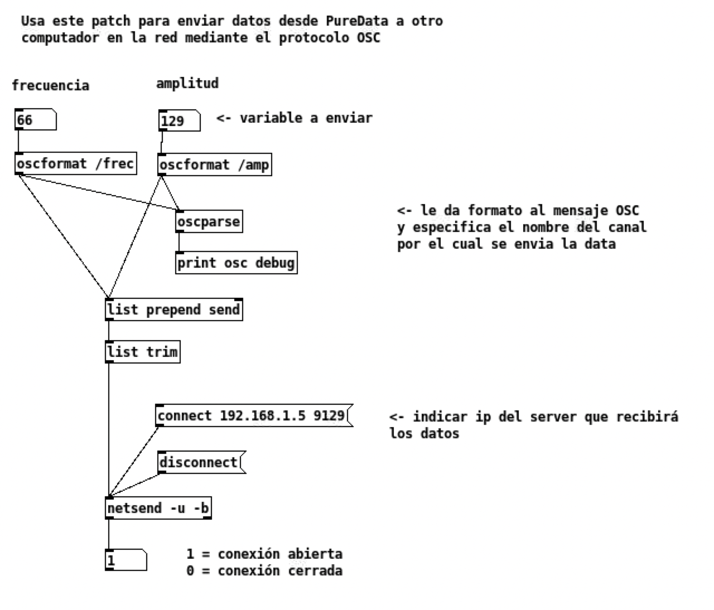

# Envia datos desde PureData al navegador
Repositorio de ejemplo para recibir datos enviados desde PureData para ser consumidos por un [cuaderno de Observable](https://observablehq.com/@esrs/puredata-to-observable). Utiliza node y [osc-js](https://github.com/adzialocha/osc-js) en modo `BridgePlugin` para crear un servidor puente que escucha mensajes OSC recibidos via UDP y los publica mediante un servidor de WebSockets. Posteriormente usaremos `osc-js` (nuevamente) en modo `WebsocketClientPlugin` para parsear WebSockets como mensajes OSC en el navegador.

## Para enviar mensajes OSC desde Pure Data
- Usa el patch de ejemplo `puredata/osc_send.pd` como base para adaptar tu propio patch: 


## Para recibir mensajes OSC al navegador
- Clona este repositorio en la máquina donde recibirás los mensajes: `$ git clone git@github.com:a7u7a/puredata-osc-to-browser.git`
- Luego: '$ npm install'
- Luego: '$ npm start'
- Output esperado: 
``` 
[nodemon] 2.0.15
[nodemon] to restart at any time, enter `rs`
[nodemon] watching path(s): *.*
[nodemon] watching extensions: js,mjs,json
[nodemon] starting `node bridge.js`
Iniciando servidor puente UDP-Websockets 
```
- Al recibir mensajes recibiremos algo como esto en el terminal: 
``` 
msg Message { offset: 16, address: '/amp', types: ',f', args: [ 123 ] }
msg Message { offset: 16, address: '/amp', types: ',f', args: [ 124 ] }
msg Message { offset: 16, address: '/amp', types: ',f', args: [ 125 ] }
msg Message { offset: 16, address: '/amp', types: ',f', args: [ 126 ] }
msg Message { offset: 16, address: '/amp', types: ',f', args: [ 125 ] }
msg Message { offset: 16, address: '/frec', types: ',f', args: [ 56 ] }
msg Message { offset: 16, address: '/frec', types: ',f', args: [ 57 ] }
msg Message { offset: 16, address: '/frec', types: ',f', args: [ 58 ] }
msg Message { offset: 16, address: '/frec', types: ',f', args: [ 59 ] }
msg Message { offset: 16, address: '/frec', types: ',f', args: [ 60 ] }
```